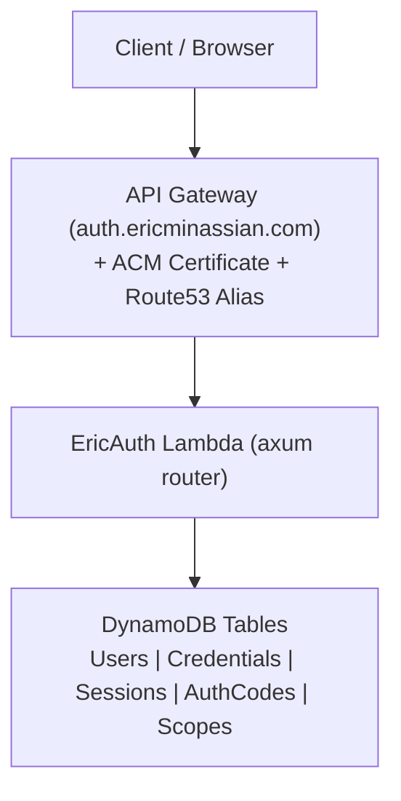
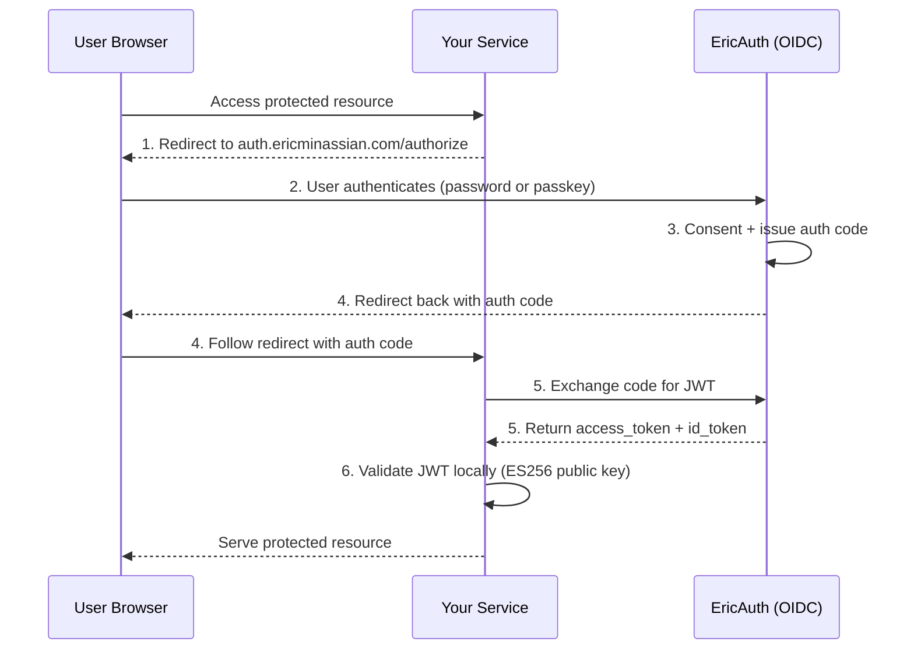
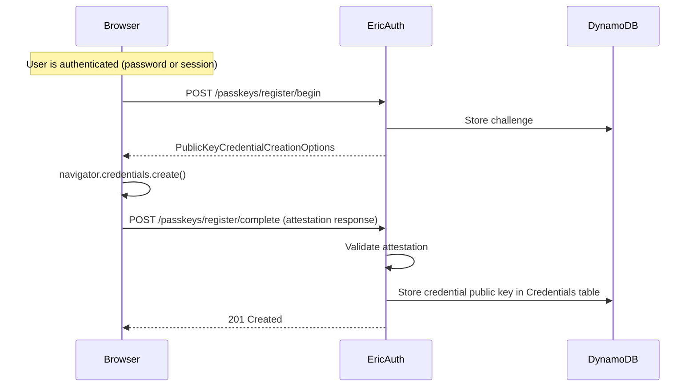
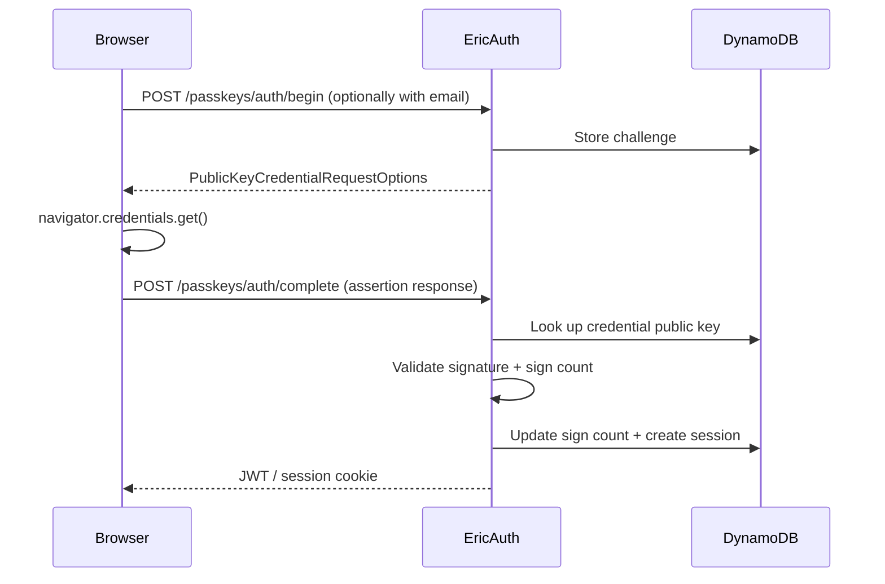
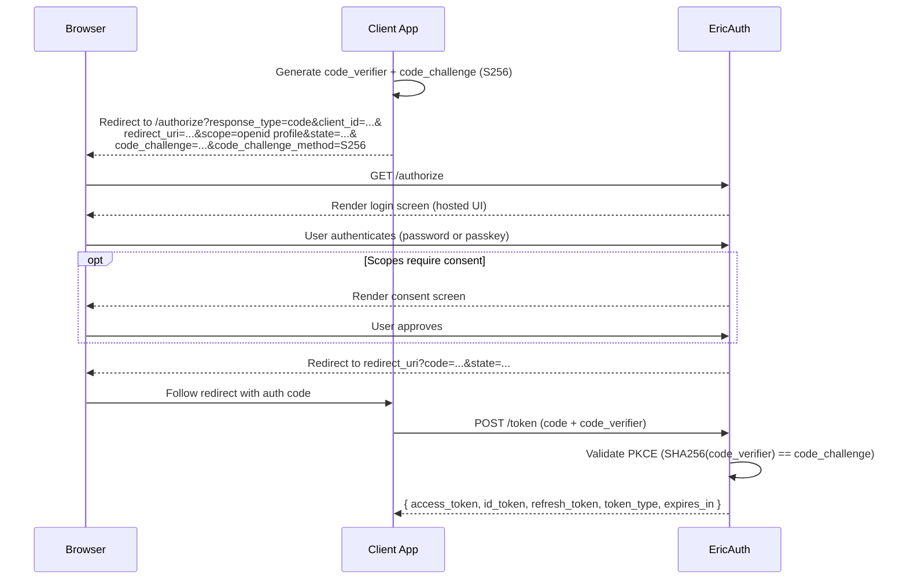

# EricAuth Design Document

## 1. Overview

EricAuth is a self-hosted authentication and authorization service built in Rust, deployed as a single serverless Lambda on AWS. It provides:

- **Authentication (AuthN):** Email/password login and WebAuthn passkeys (passwordless)
- **Authorization (AuthZ):** Scope-based access control via JWT tokens
- **OAuth2/OIDC Provider:** Standards-compliant provider so other services can delegate auth
- **Hosted Auth Screens:** Server-rendered HTML login/signup/consent pages

The service runs at `auth.ericminassian.com` and serves as the central identity provider for all services under `ericminassian.com`.

## 2. Architecture

### 2.1 Deployment Model

A single serverless Lambda binary (axum router) behind API Gateway, deployed via AWS CDK. API Gateway forwards all routes to this one binary, and route dispatch happens inside axum.

### 2.2 High-Level Architecture



### 2.3 How Other Services Integrate

Services validate JWTs locally using EricAuth's public key (available at the JWKS endpoint). No network call to EricAuth is needed for request-time authorization.



## 3. Authentication (AuthN)

### 3.1 Email/Password (Existing)

**Current state:** Signup and login endpoints exist with Argon2id password hashing, session cookie issuance, and password strength validation.

**Changes needed:**
- Replace session cookies with JWT issuance for API consumers
- Keep session cookies for the hosted UI (browser sessions)
- Add logout endpoint (session deletion)
- Add session validation endpoint
- Propagate errors properly (remove `.unwrap()` calls)

### 3.2 WebAuthn Passkeys (New)

Passkeys serve as a primary, passwordless authentication method. Users can register passkeys after initial account creation (via password) or during signup if their device supports it.

**WebAuthn Configuration:**
- **RP ID:** `auth.ericminassian.com`
- **RP Name:** `EricAuth`
- **RP Origin:** `https://auth.ericminassian.com`
- **Attestation:** `none` (we don't need hardware attestation)
- **User Verification:** `preferred`
- **Resident Key:** `preferred` (enables discoverable credentials / usernameless login)

**Registration Flow:**



**Authentication Flow:**



**Rust Crate:** `webauthn-rs` -- mature, well-maintained WebAuthn library for Rust.

### 3.3 Account Recovery

- Users generate recovery codes at registration time (using the existing `generate_random_recovery_code()` function)
- Recovery codes are hashed (SHA-256) before storage
- Each code is single-use
- Recovery codes allow password reset and passkey re-registration

## 4. Authorization (AuthZ)

### 4.1 Scope-Based Access Control

Scopes are string identifiers that represent permissions. They follow the pattern `resource:action`.

**Examples:**
- `profile:read` -- read user profile
- `posts:write` -- create/edit posts
- `admin:users` -- manage users

**Scope Assignment:**
- Scopes are assigned to users directly (stored in the `UserScopes` table)
- When issuing a JWT, the granted scopes are included in the `scope` claim
- Services check the `scope` claim to authorize requests

### 4.2 JWT Structure

**Header:**
```json
{
  "alg": "ES256",
  "typ": "JWT",
  "kid": "<key-id>"
}
```

**Payload:**
```json
{
  "iss": "https://auth.ericminassian.com",
  "sub": "<user-id>",
  "aud": "<client-id or service>",
  "exp": 1700000000,
  "iat": 1699999000,
  "scope": "profile:read posts:write",
  "email": "user@example.com"
}
```

**Signing:**
- Algorithm: ES256 (ECDSA with P-256)
- Key pair stored in AWS Secrets Manager (or as an encrypted environment variable)
- Key rotation supported via `kid` header -- JWKS endpoint serves current and previous keys
- Access token lifetime: 15 minutes
- Refresh tokens: opaque, stored hashed in DB, 30-day lifetime

### 4.3 Token Endpoints

| Endpoint | Purpose |
|----------|---------|
| `POST /token` | Exchange auth code or refresh token for access/refresh tokens |
| `POST /token/revoke` | Revoke a refresh token |
| `GET /.well-known/jwks.json` | Public key set for JWT verification |

## 5. OAuth2 / OIDC Provider

### 5.1 Supported Specifications

- **OAuth 2.0 Authorization Code Grant** with **PKCE** (RFC 7636)
- **OpenID Connect Core 1.0** (ID tokens, UserInfo endpoint)
- **OpenID Connect Discovery 1.0** (`.well-known/openid-configuration`)

### 5.2 Endpoints

| Endpoint | Method | Purpose |
|----------|--------|---------|
| `GET /.well-known/openid-configuration` | GET | OIDC discovery document |
| `GET /.well-known/jwks.json` | GET | JSON Web Key Set |
| `GET /authorize` | GET | Authorization endpoint (renders consent screen) |
| `POST /token` | POST | Token endpoint (code exchange, refresh) |
| `GET /userinfo` | GET | Returns user claims for a valid access token |
| `POST /token/revoke` | POST | Token revocation |

### 5.3 Authorization Code + PKCE Flow



### 5.4 Client Registration

For the single-tenant model, clients are registered directly in DynamoDB (no dynamic registration endpoint needed initially). Each client record contains:

- `client_id` -- unique identifier
- `client_name` -- display name (shown on consent screen)
- `redirect_uris` -- allowed redirect URIs
- `allowed_scopes` -- scopes this client can request

## 6. Hosted Auth Screens

Server-rendered HTML pages served directly from Lambda functions. Templates are compiled into the binary at build time.

**Template Engine:** Askama (compile-time Jinja2-like templates for Rust -- zero runtime overhead, type-safe)

### 6.1 Pages

| Page | Route | Purpose |
|------|-------|---------|
| Login | `GET /login` | Email/password form + passkey button |
| Signup | `GET /signup` | Registration form |
| Consent | `GET /consent` | OAuth2 scope approval screen |
| Error | -- | Generic error display |
| Passkey Registration | `GET /passkeys/manage` | Manage registered passkeys |
| Account Recovery | `GET /recover` | Recovery code entry |

### 6.2 Design Principles

- Minimal, clean UI -- no JavaScript framework, minimal inline JS for WebAuthn API calls only
- Progressive enhancement -- forms work without JS; passkey features degrade gracefully
- Inline CSS (no external stylesheets to avoid extra requests on Lambda cold starts)
- CSRF protection via `SameSite=Strict` cookies and double-submit token pattern

## 7. Database Schema

All tables use DynamoDB with on-demand (PAY_PER_REQUEST) billing.

### 7.1 Users Table (existing, modified)

| Attribute | Type | Key | Notes |
|-----------|------|-----|-------|
| `id` | String (UUID v4) | PK | |
| `email` | String | GSI `emailIndex` PK | |
| `password_hash` | String | | Argon2id hash; nullable if passkey-only |
| `recovery_codes` | List\<String\> | | SHA-256 hashed, single-use |
| `created_at` | String (ISO 8601) | | |

### 7.2 Credentials Table (new -- WebAuthn)

| Attribute | Type | Key | Notes |
|-----------|------|-----|-------|
| `credential_id` | String (base64url) | PK | WebAuthn credential ID |
| `user_id` | String (UUID) | GSI `userIdIndex` PK | |
| `public_key` | Binary | | COSE public key |
| `sign_count` | Number | | Replay attack detection |
| `transports` | List\<String\> | | e.g., `["internal", "hybrid"]` |
| `created_at` | String (ISO 8601) | | |
| `last_used_at` | String (ISO 8601) | | |

### 7.3 Sessions Table (existing, kept for hosted UI)

| Attribute | Type | Key | Notes |
|-----------|------|-----|-------|
| `id` | String (SHA-256 of token) | PK | |
| `user_id` | String (UUID) | | |
| `expires_at` | String (ISO 8601) | | 30-day TTL |
| `ip_address` | String | | For audit |

### 7.4 Auth Codes Table (new -- OAuth2)

| Attribute | Type | Key | Notes |
|-----------|------|-----|-------|
| `code` | String (SHA-256 hash) | PK | |
| `client_id` | String | | |
| `user_id` | String (UUID) | | |
| `redirect_uri` | String | | Must match on exchange |
| `scope` | String | | Space-separated scopes |
| `code_challenge` | String | | PKCE S256 challenge |
| `expires_at` | String (ISO 8601) | | Short-lived: 10 minutes |
| `used` | Boolean | | Single-use enforcement |

### 7.5 Refresh Tokens Table (new)

| Attribute | Type | Key | Notes |
|-----------|------|-----|-------|
| `token_hash` | String (SHA-256) | PK | |
| `user_id` | String (UUID) | | |
| `client_id` | String | | |
| `scope` | String | | Granted scopes |
| `expires_at` | String (ISO 8601) | | 30-day lifetime |
| `revoked` | Boolean | | |

### 7.6 Clients Table (new -- OAuth2)

| Attribute | Type | Key | Notes |
|-----------|------|-----|-------|
| `client_id` | String | PK | |
| `client_name` | String | | Displayed on consent screen |
| `redirect_uris` | List\<String\> | | Allowed redirect URIs |
| `allowed_scopes` | List\<String\> | | Scopes this client may request |

### 7.7 User Scopes Table (new)

| Attribute | Type | Key | Notes |
|-----------|------|-----|-------|
| `user_id` | String (UUID) | PK | |
| `scopes` | List\<String\> | | Scopes assigned to this user |

### 7.8 WebAuthn Challenges Table (new -- ephemeral)

| Attribute | Type | Key | Notes |
|-----------|------|-----|-------|
| `challenge_id` | String | PK | |
| `challenge_data` | String (JSON) | | Serialized challenge state |
| `expires_at` | String (ISO 8601) | | TTL: 5 minutes |

## 8. API Endpoints (Complete)

### 8.1 Health & Discovery

| Method | Path | Auth | Description |
|--------|------|------|-------------|
| GET | `/health` | None | Health check |
| GET | `/.well-known/openid-configuration` | None | OIDC discovery |
| GET | `/.well-known/jwks.json` | None | Public keys |

### 8.2 Authentication

| Method | Path | Auth | Description |
|--------|------|------|-------------|
| POST | `/signup` | None | Create account (email/password) |
| POST | `/login` | None | Login (email/password) |
| POST | `/logout` | Session | Destroy session |
| POST | `/passkeys/register/begin` | Session | Start passkey registration |
| POST | `/passkeys/register/complete` | Session | Complete passkey registration |
| POST | `/passkeys/auth/begin` | None | Start passkey authentication |
| POST | `/passkeys/auth/complete` | None | Complete passkey authentication |
| POST | `/recover` | None | Account recovery via recovery code |

### 8.3 OAuth2 / OIDC

| Method | Path | Auth | Description |
|--------|------|------|-------------|
| GET | `/authorize` | Session | Authorization endpoint (shows login/consent) |
| POST | `/token` | None* | Token exchange (code -> tokens) |
| POST | `/token/revoke` | None* | Revoke refresh token |
| GET | `/userinfo` | Bearer JWT | User info claims |

*`/token` and `/token/revoke` authenticate via `client_id` in the request body (public clients with PKCE).

### 8.4 Hosted UI

| Method | Path | Auth | Description |
|--------|------|------|-------------|
| GET | `/login` | None | Login page |
| GET | `/signup` | None | Signup page |
| GET | `/consent` | Session | OAuth2 consent page |
| GET | `/passkeys/manage` | Session | Passkey management page |
| GET | `/recover` | None | Account recovery page |

## 9. Security Considerations

### 9.1 Cryptography
- **Passwords:** Argon2id (already implemented)
- **JWT signing:** ES256 (ECDSA P-256), keys in AWS Secrets Manager
- **Token storage:** All tokens (session, auth code, refresh) stored as SHA-256 hashes
- **Encryption at rest:** AES-256-GCM module available for sensitive fields

### 9.2 Transport Security
- HTTPS enforced via API Gateway + ACM certificate
- `Strict-Transport-Security` header on all responses
- `Secure` flag on all cookies

### 9.3 Session & Token Security
- HttpOnly, Secure, SameSite=Lax cookies for sessions
- Short-lived access tokens (15 min)
- Refresh token rotation (old token revoked on use)
- Auth codes: single-use, 10-minute expiry, bound to PKCE verifier

### 9.4 WebAuthn Security
- Challenge expiry (5 minutes)
- Sign count verification (replay detection)
- Origin validation against RP origin

### 9.5 General
- CSRF protection on all state-changing UI endpoints
- Rate limiting on login/signup (future: per-IP throttling using the already-extracted IP)
- Input validation on all endpoints
- No `unsafe` code (`forbid` lint)

## 10. Implementation Phases

### Phase 1: Core Auth Hardening
- Add proper error propagation (remove `.unwrap()` calls)
- Add logout endpoint
- Add session validation
- Add `created_at` timestamps to users
- Add rate limiting groundwork (IP tracking)

### Phase 2: JWT Infrastructure
- Generate ES256 key pair, store in Secrets Manager
- Implement JWT signing and verification
- Add `/.well-known/jwks.json` endpoint
- Implement refresh token flow (`/token`, `/token/revoke`)
- Add scopes to user model and JWT claims

### Phase 3: WebAuthn Passkeys
- Add `webauthn-rs` dependency
- Create Credentials and Challenges tables
- Implement passkey registration endpoints
- Implement passkey authentication endpoints
- Add WebAuthn JavaScript for the hosted UI

### Phase 4: Hosted Auth UI
- Add Askama templates and inline CSS
- Build login, signup, and error pages
- Add CSRF protection
- Wire up passkey JavaScript in login page

### Phase 5: OAuth2/OIDC Provider
- Implement `/authorize` endpoint with login redirect
- Implement auth code generation and storage
- Implement `/token` endpoint with PKCE validation
- Implement consent screen
- Add Clients table and client registration (manual/CLI)
- Implement `/.well-known/openid-configuration`
- Implement `/userinfo` endpoint
- Implement ID token issuance

### Phase 6: Polish & Hardening
- Comprehensive integration tests
- CDK tests
- Rate limiting implementation
- Security audit (OWASP checklist)
- Documentation for service integration

## 11. Rust Crate Additions

| Crate | Purpose |
|-------|---------|
| `webauthn-rs` | WebAuthn server implementation |
| `jsonwebtoken` | JWT signing/verification (ES256) |
| `askama` | Compile-time HTML templates |
| `serde_json` | JSON serialization (already indirect dep) |
| `url` | URL parsing for redirect URI validation |
| `base64` | Base64url encoding for WebAuthn/JWT |

## 12. Open Questions

1. **Key management:** Store ES256 private key in Secrets Manager and load at Lambda init, or use KMS for signing operations directly?
2. **Consent persistence:** Should we remember user consent per client (skip consent screen on subsequent logins)?
3. **Account linking:** If a user signs up with password and later adds a passkey, should they be able to remove their password entirely?
4. **Session limits:** Max number of concurrent sessions per user?

## 13. Roadmap Track Implementation Status (Pre-Merge)

As of 2026-02-14, maximal roadmap work is being developed in parallel track worktrees and has not yet been merged into `main`.

| Track | Worktree | Current status | Latest verification |
|-------|----------|----------------|---------------------|
| Track A - Identity lifecycle + MFA | `.worktrees/track-a-identity-lifecycle` | Implemented in feature branch | `make lint` + `make test` passed (94 tests) |
| Track B - Federation | `.worktrees/track-b-federation` | Implemented in feature branch | `make lint` + `make test` passed (85 tests); `make e2e` passed; `make synth` passed |
| Track C - Security/compliance | `.worktrees/track-c-security-compliance` | Implemented in feature branch | `make lint` + `make test` passed (87 tests) |
| Track D - Admin/dev experience | `.worktrees/track-d-admin-dx` | Implemented in feature branch | `make lint` + `make test` passed (77 tests) |
| Track E - Machine authz | `.worktrees/track-e-machine-authz` | Implemented in feature branch | `make lint` + `make test` passed (90 tests) |

Integration notes:

- Verification above is branch-local readiness evidence, not merged-release proof.
- Integration should proceed track-by-track onto a convergence branch with full suite reruns.
- Final release readiness requires fresh post-convergence verification and PR validation.
